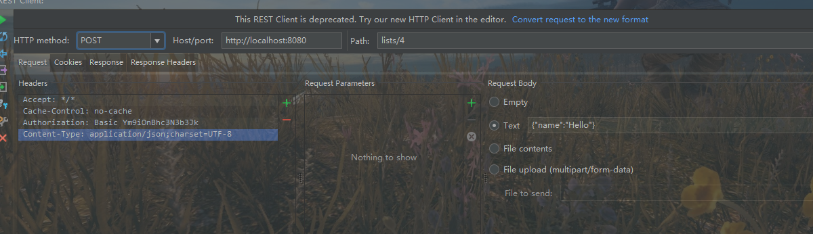

## hateoas

### gs-rest-hateoas

   这是spring官网提供的样例，    src-mian-java-hello目录下，简单写了一个Hello，World的：

   继承ResourceSupport的资源类Greeting，继承之后，具有了add(Link link)的方法，加入控制器里面创建出来的link；

​     控制器GreetingController，使用@RestController注解，里面greeting'方面调用spring-hateoas提供一系列静态方法linkTo,methodOn创建一个链接。

​       

​     src-mian-java-people目录下，是自己参看这两个eg写的。

​       现在只明白Resource<T> extends ResourceSupport ，并定义了一些自己的构造函数，所以自己定义的资源类（以PersonResource为例）可以继承两者任意的一个（确定资源有默认构造函数，不然跑的时候会出错），但是，继承Resource，生成的链接会多资源PersonResource定义的属性。

​       hello样例中只有资源类，没有与之对应的实体类，people里面参照todolist的设置模式，实体类--实体资源类--资源汇编

​        AbstractEntity implements Identifiable<Long>，这个只是为了后面生成链接时，可以使用slash(实体类)，默认调用的是bean.getId()方法.

​     实体类上面的注解@Relation(value = "person", collectionRelation = "persons")意思是value是一个资源的名字，collection是这个资源的集合的名字。

   里面还有很多没弄懂的东西。找不到与前台页面交互设计的样例（hateoas还没被广泛应用，只能使用mock、Traverson验证uri的预期性），所以暂时研究到这里。

   

---

### todolist

   这是一个老外写的例子，src-mian目录下

   启动顺序：先跑一遍ApplicationTest，生成用户及密码，然后再跑Application

​         这里使用idea自带的restClient模拟发送请求

get请求就不说了

post请求，传参，需要现在headers加Conten-Type属性

Request Body这里,选Text，使用json字符串,如：{"name":"Hello"}

​         项目在config使用了spring-security拦截验证，所以访问的时候需要输入登录名密码，浏览器不支持解析返回数据的格式，所以使用restClient模拟请求，需要把请求头的Authorization添加到request，如上图。

​    